# FocusFlow — Final Design

## Modifications Since Part B

Since Part B, the following features were designed and implemented:

### New Functional Requirements
| Feature | Description |
|---|---|
| AI Task Planner | Conversational AI breaks a goal into exactly 5 tasks; user can accept, refine with feedback, or discard |
| Eat That Frog | AI-identified highest-priority task surfaced on Dashboard with one-click "Start Now" → moves task to IN_PROGRESS |
| AI Schedule (Board) | Schedules TODO/IN_PROGRESS tasks into the calendar after current time, with 30-min Rest gaps, multi-day rollover |
| Calendar Import Tasks | Import any TODO tasks directly into calendar with conflict-free slot detection |
| Pomodoro on Board | Persistent 🍅 button on every IN_PROGRESS card in the Kanban view — starts Pomodoro immediately |
| Data Export | Export tasks, Pomodoro sessions, and calendar blocks as CSV or JSON via `/api/export/*` |
| Deadline Notifications | Background APScheduler scans tasks hourly; pushes browser notifications for approaching deadlines |
| Subtask Management | Subtasks can be created, toggled, and deleted inline on task cards |
| User Streak | Consecutive Pomodoro-active days tracked and displayed in Timer stats |

### Architectural Changes Since Part B
- `app/routers/export.py` added — data export layer (Repository pattern)
- `app/routers/ai.py` refactored with explicit **Strategy** + **Adapter** patterns (documented in-file)
- `app/notifications/` package added — APScheduler background job + push router
- Frontend `AITaskGenerator.jsx` rewritten as a conversational multi-step component
- `frontend/src/utils/smartSchedule.js` — `findFreeSlot()` utility added for conflict-free scheduling

---

## Architecture Overview

FocusFlow follows a **3-tier architecture**:

```
┌─────────────────────────────────┐
│        React Frontend           │  Tailwind CSS, React Router, FullCalendar
│  Pages / Components / Contexts  │  @hello-pangea/dnd (drag-and-drop)
└────────────┬────────────────────┘
             │ REST + WebSocket (JWT Bearer)
┌────────────▼────────────────────┐
│       FastAPI Backend           │  Python 3.11, Pydantic, Motor (async)
│  Routers / Services / Auth      │  APScheduler, PyJWT, bcrypt
└────────────┬────────────────────┘
             │ Motor async driver
┌────────────▼────────────────────┐
│          MongoDB                │  Collections: users, tasks, sessions,
│                                 │  blocks, workspaces, notifications
└─────────────────────────────────┘
```

---

## Class Diagram

> **Key:** Only architecturally significant components shown.

```mermaid
classDiagram

    %% ── BACKEND MODELS ──────────────────────────────────────────────

    class User {
        <<MongoDB Document>>
        +id: str
        +name: str
        +email: str
        +hashed_password: str
        +preferences: dict
        +streak: int
        +created_at: datetime
    }

    class Task {
        <<MongoDB Document>>
        +id: str
        +user_id: str
        +title: str
        +description: str
        +priority: Priority
        +status: TaskStatus
        +category: str
        +deadline: datetime
        +recurrence: Recurrence
        +subtasks: List~Subtask~
        +estimated_minutes: int
        +created_at: datetime
    }

    class PomodoroSession {
        <<MongoDB Document>>
        +id: str
        +user_id: str
        +task_id: str
        +phase: TimerPhase
        +duration_minutes: int
        +completed_at: datetime
    }

    class TimeBlock {
        <<MongoDB Document>>
        +id: str
        +user_id: str
        +title: str
        +start_time: str
        +end_time: str
        +task_id: str
        +color: str
        +recurrence: str
        +recurrence_group_id: str
    }

    class Workspace {
        <<MongoDB Document>>
        +id: str
        +name: str
        +owner_id: str
        +members: List~str~
    }

    class Notification {
        <<MongoDB Document>>
        +id: str
        +user_id: str
        +task_id: str
        +message: str
        +read: bool
        +created_at: datetime
    }

    User "1" --> "many" Task : owns
    User "1" --> "many" PomodoroSession : logs
    User "1" --> "many" TimeBlock : schedules
    User "many" --> "many" Workspace : belongs to
    User "1" --> "many" Notification : receives
    Task "1" --> "many" PomodoroSession : tracked by
    Task "1" --> "0..1" TimeBlock : linked to

    %% ── BACKEND ROUTERS / SERVICES ──────────────────────────────────

    class FastAPIRouter {
        <<Controller>>
        +tasks_router
        +calendar_router
        +ai_router
        +timer_router
        +export_router
        +auth_router
        +notifications_router
    }

    class GeminiAdapter {
        <<Adapter>>
        -api_key: str
        -model: GenerativeModel
        +generate(prompt: str) str
    }

    class AIStrategy {
        <<Strategy - Abstract>>
        +build_prompt() str
        +parse_response(raw: str) Any
        +execute(adapter, data) Any
    }

    class BreakdownStrategy {
        <<Strategy - Concrete>>
        +build_prompt() str
        +parse_response(raw: str) List~str~
    }

    class GenerateTasksStrategy {
        <<Strategy - Concrete>>
        +build_prompt() str
        +parse_response(raw: str) List~GeneratedTask~
    }

    class ScheduleStrategy {
        <<Strategy - Concrete>>
        +build_prompt() str
        +parse_response(raw: str) List~AIScheduleBlock~
    }

    class MongoRepository {
        <<Repository>>
        -db: AsyncIOMotorDatabase
        +find_one(col, query) dict
        +find_many(col, query) List~dict~
        +insert_one(col, doc) str
        +update_one(col, query, update) bool
        +delete_one(col, query) bool
    }

    class DeadlineScanner {
        <<Observer - Background>>
        -scheduler: APScheduler
        +scan_and_notify() void
    }

    AIStrategy <|-- BreakdownStrategy
    AIStrategy <|-- GenerateTasksStrategy
    AIStrategy <|-- ScheduleStrategy
    AIStrategy --> GeminiAdapter : uses
    FastAPIRouter --> MongoRepository : delegates DB ops
    FastAPIRouter --> AIStrategy : invokes
    DeadlineScanner --> MongoRepository : queries tasks
    DeadlineScanner --> Notification : creates

    %% ── FRONTEND ─────────────────────────────────────────────────────

    class AuthContext {
        <<Context / Provider>>
        +user: UserState
        +token: string
        +login(email, password) void
        +logout() void
        +register(name, email, password) void
    }

    class TimerContext {
        <<Context / Provider>>
        +phase: TimerPhase
        +timeLeft: number
        +focusMins: number
        +isRunning: bool
        +startFocus(taskId) void
        +pauseTimer() void
        +resetTimer() void
    }

    class ThemeContext {
        <<Context / Provider>>
        +isDark: bool
        +toggleTheme() void
    }

    class NotificationContext {
        <<Observer - Frontend>>
        +notifications: List
        +unreadCount: number
        +markRead(id) void
        +connectWebSocket() void
    }

    class APIService {
        <<Service>>
        -axios: AxiosInstance
        +get(url) Promise
        +post(url, data) Promise
        +put(url, data) Promise
        +delete(url) Promise
    }

    class TaskService {
        <<Service>>
        +getTasks() Promise~List~Task~~
        +createTask(data) Promise~Task~
        +updateTask(id, data) Promise~Task~
        +deleteTask(id) Promise
    }

    class SmartSchedule {
        <<Utility>>
        +findFreeSlot(date, duration, blocks, skipId, now) TimeSlot
    }

    class DashboardPage {
        <<View>>
        +AITaskGenerator
        +EatThatFrog
        +ByPriority
        +StatsWidgets
    }

    class TasksPage {
        <<View>>
        +KanbanBoard
        +AIScheduleBanner
        +PomodoroButton
    }

    class CalendarPage {
        <<View>>
        +FullCalendar
        +ImportTasksPanel
        +BlockModal
    }

    class TimerPage {
        <<View>>
        +PomodoroTimer
        +SessionLog
        +StreakDisplay
    }

    AuthContext --> APIService : provides token to
    TimerContext --> APIService : logs sessions via
    NotificationContext --> APIService : fetches via WebSocket
    TaskService --> APIService : wraps
    TasksPage --> TaskService : reads/writes tasks
    TasksPage --> SmartSchedule : uses for scheduling
    CalendarPage --> SmartSchedule : uses for import
    DashboardPage --> TaskService : reads tasks
    TimerPage --> TimerContext : consumes
```

> Design patterns are annotated with `<<stereotype>>`.



---

## Design Patterns Applied

| Pattern | Where | Role |
|---|---|---|
| **Strategy** | `backend/app/routers/ai.py` | Each AI feature (Breakdown, Generate, Schedule, Frog, Tips) is a separate `AIStrategy` subclass. Adding a new feature = adding a new class, no existing code modified. |
| **Adapter** | `GeminiAdapter` in `ai.py` | Wraps Google GenAI SDK. Backend business logic never imports the SDK directly — only calls `adapter.generate(prompt)`. Swap providers by replacing the adapter. |
| **Repository** | `MongoRepository` (implicit in all routers) | All DB access goes through Motor async calls abstracted per collection, keeping routers free of raw query logic. |
| **Observer** | `DeadlineScanner` (backend) + `NotificationContext` (frontend) | Background job scans for approaching deadlines and publishes via WebSocket; frontend subscribes and renders notification badges. |
| **Context/Provider** | `AuthContext`, `TimerContext`, `ThemeContext`, `NotificationContext` | React Context API provides shared state across the component tree without prop drilling. |
| **MVC** | Entire architecture | FastAPI routers = Controller, Pydantic models = Model, React pages/components = View. |
