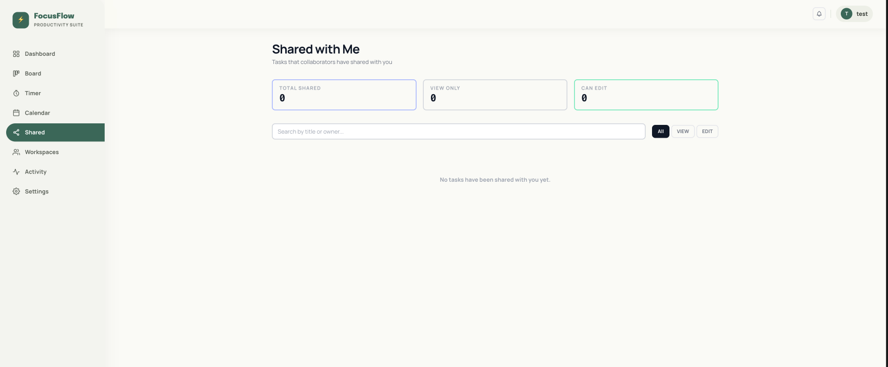
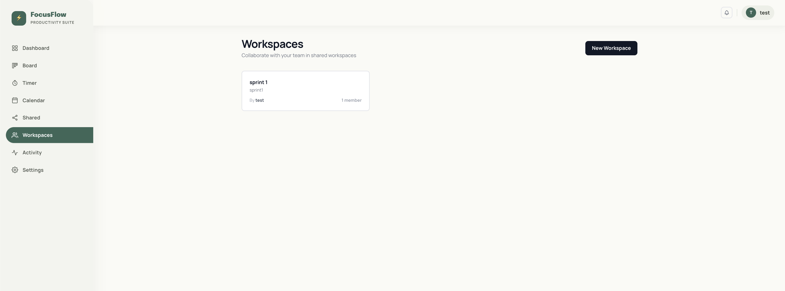
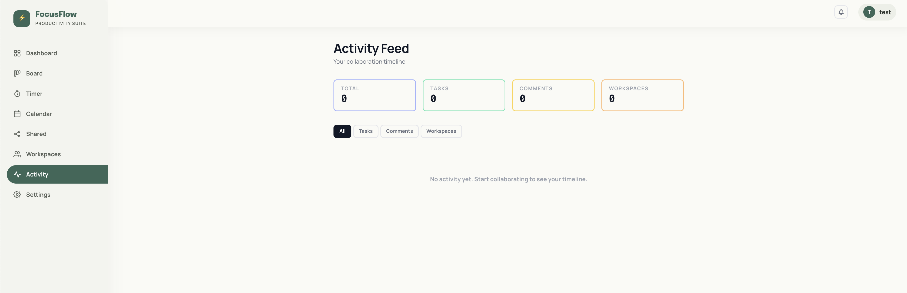

# Collaboration

FocusFlow supports team collaboration through task sharing, workspaces, activity feeds, and real-time notifications.

---

## Shared Tasks

You can share any task you own with other FocusFlow users.

**How to share a task:**
1. Open the **Board** page
2. Click the **Share** icon on a task card
3. Enter the email address of the user you want to share with
4. Click **Share**

The recipient can view and edit the shared task. Shared tasks appear in their **Shared** section in the sidebar.

---

## Workspaces

Workspaces are collaborative spaces where team members can work together.

**Creating a Workspace:**
1. Click **Workspaces** in the left sidebar
2. Click **+ New Workspace**
3. Give it a name
4. Invite members by email

**Inside a Workspace:**
- View all workspace members
- See tasks and activity associated with the workspace
- All members receive real-time updates

---

## Activity Feed

The **Activity** page shows a real-time timeline of all actions taken on tasks you own or collaborate on:
- Task created / updated / completed
- Comments added
- Tasks shared with you
- Workspace member joined

---

## Real-Time Notifications

The **notification bell** (🔔) in the top header shows unread notifications.

You receive notifications for:
- A task you own is approaching its deadline (within 24 hours)
- A task is shared with you
- A collaborator updates a shared task
- A workspace member joins

Notifications are pushed in real-time via WebSocket — no page refresh needed.
